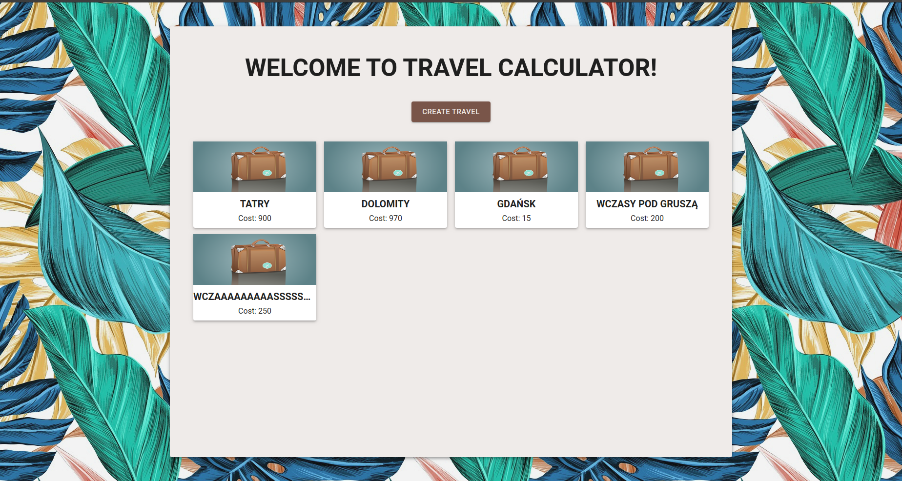
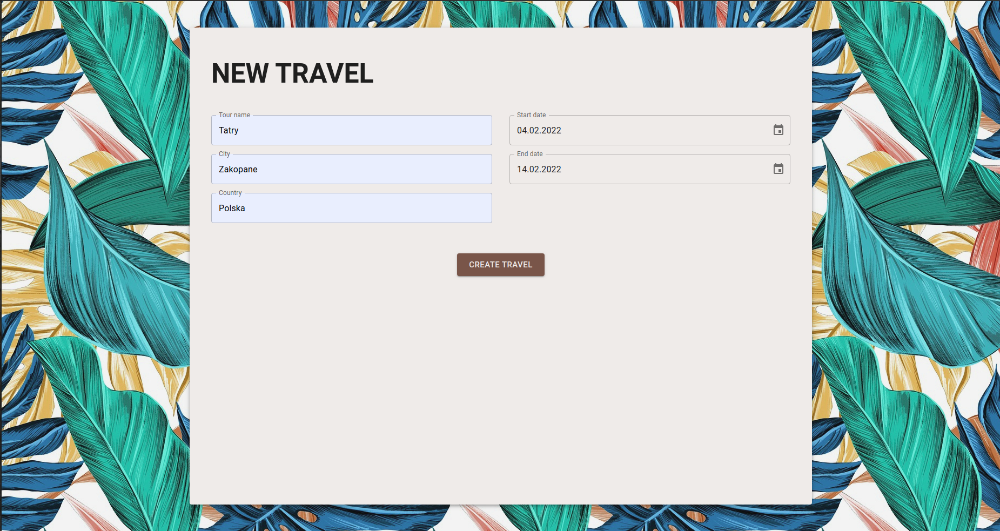
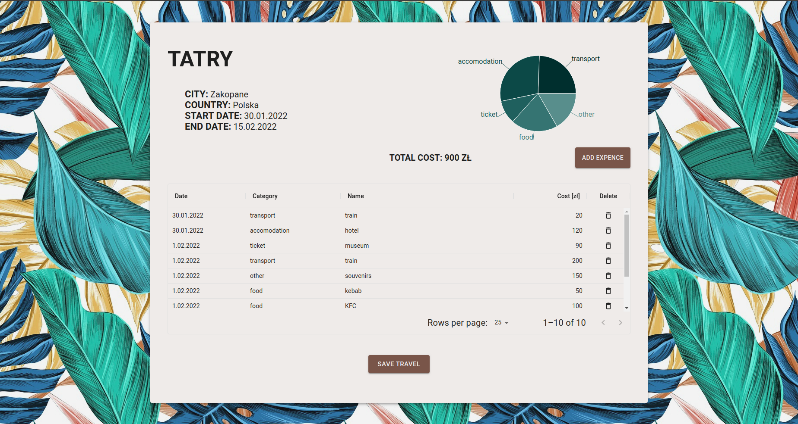

# TravelCostPlanner
The aplication is used to save the expenses of trips, allowing them to be presented graphically. Live demo [_here_](https://travel-cost-planner.herokuapp.com)

## Technologies Used
- React
- React Router
- Material-UI 5
- Emotion
- GRID
- Recharts
- Create React App
- JSON Server

## Screenshots

## Setup
- npm install --dev
- npm run build
- node server.js

## Contact
emilia.parzych92@gmail.com
